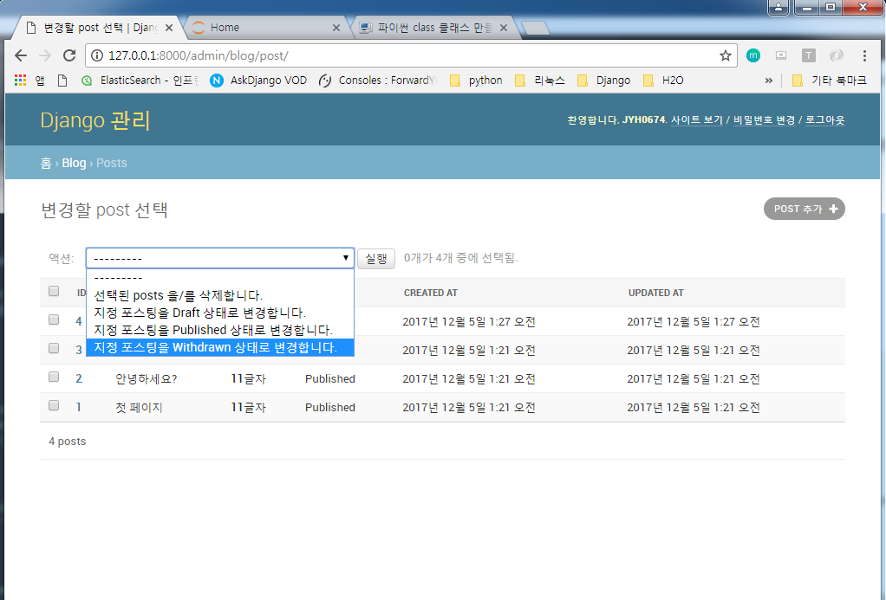

# Django Admin

[ASKDjango 수업 자료를 토대로 작성되었습니다.](https://nomade.kr/vod/django/11/)

## Django admin

- staff/superuser 계정에 한해 접근 가능
- 모델 클래스만 등록하면, 조회/추가/수정/삭제 웹 인터페이스가 제공

## ModelAdmin OPTIONS
- `list_display` : Admin 목록에 보여질 필드 목록
- `list_display_links` : 목록 내에서 링크로 지정할 필드 목록
  - 이를 지정하지 않으면, 첫번째 필드에만 링크 적용
- `list_editable` : 목록 상에서 수정할 필드 목록
- `list_per_page`(디폴트 : 100) : 페이지 별로 보여질 최대 갯수
- `list_filter` : 필터 옵션을 제공할 필드 목록
- `actions` : 목록에서 수행할 action 목록
- `fieids` : add/change 폼에 노출할 필드 목록
- `fieldsets` : add/change 폼에 노출할 필드목록(fieldset)
- `formfield_overrides` : 특정 Form Field에 대한 속성 재정의
- `form` : 디폴트로 모델 클래스에 대한 Form Class 지정

## list_display 옵션

- 모델 인스턴스 필드명/속성명/함수명 뿐만 아니라, ModelAdmin 내 메소드도 지정 가능
- 외래키(Foreign Key)를 지정한다면, 관련 object의 `__str__()`값이 노출
- ManyToManyField 미지원


## Tag Escape

- Django에서는 파이썬 코드/변수를 통해 보여지는 HTML Tag에 대해 Auto Escape를 수행
- a/img/script 태그 등으로 인한 허용치 않은 코드 실행 방지
   - 악성 스크립트 실행
- 특징 문자열에 한해, 이를 해제하기 위해 <b>autoescape off</b> template tag를 적용하거나, 문자열에 format_html(), format_html_join(), mark_safe() 적용

## Admin actions

- 대개 선택된 Model Instance 들에 대해 Bulk Update 용도 구현

- ModelAdmin 클래스내 메소드(멤버함수)로 action 함수를 구현
  - 메소드.short_description을 통해, action 설명 추가
- ModelAdmin actions 내에 등록

```
from django.contrib import admin
from .models import Post
from django.utils.safestring import mark_safe

@admin.register(Post)
class PostAdmin(admin.ModelAdmin):
    list_display = ['id', 'title', 'content_size', 'status',
                    'created_at', 'updated_at']
    actions = ['make_draft', 'make_published', 'make_withdrawn']


    def content_size(self, post):
        return mark_safe("<strong>{}</strong>글자".format(len(post.content)))
    content_size.short_description = "글자수"


    def make_draft(self, request, queryset):
        updated_count = queryset.update(status="d") #QuerySet.Update
        self.message_user(request, "{}건의 포스팅을 Published 상태로 변경".format(updated_count))
    make_draft.short_description = '지정 포스팅을 Draft 상태로 변경합니다.'


    def make_published(self, request, queryset):
        updated_count = queryset.update(status="p") #QuerySet.Update
        self.message_user(request, "{}건의 포스팅을 Published 상태로 변경".format(updated_count))
    make_published.short_description = '지정 포스팅을 Published 상태로 변경합니다.'


    def make_withdrawn(self, request, queryset):
        updated_count = queryset.update(status="w") #QuerySet.Update
        self.message_user(request, "{}건의 포스팅을 Published 상태로 변경".format(updated_count))
    make_withdrawn.short_description = '지정 포스팅을 Withdrawn 상태로 변경합니다.'
        # django message framework 활용
```
- queryset.update는 지정 조건의 다수 Record를 갱신하고, 그 Record 갯수를 리턴해줌

- 실행 결과


