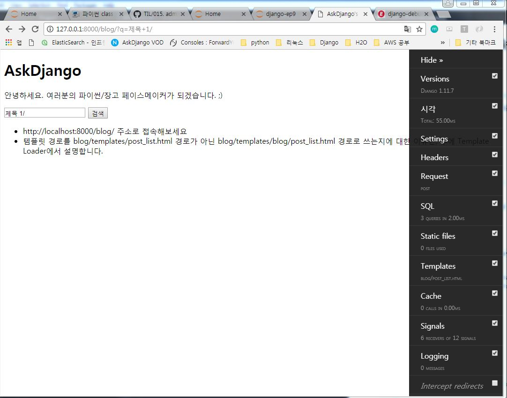

# CRUD

[ASKDjango 수업 자료를 토대로 작성되었습니다.](https://nomade.kr/vod/django/12/)


## Model Manager
- DB 질의 인터페이스 제공
- 디폴트 Manager로서 ModelCls.objects가 제공

## QuerySet

- SQL을 생성해주는 인터페이스
- Model Manager를 통해, 해당 Model에 대한 QuerySet을 획득
  - Post.objects.all() : `SELECT * FROM post;`
  - Post.objects.create() : `INSERT INTO post VALUES(...)`
- Chaining 지원 : QuerySet 수행 리턴 값이 다시 QuerySet


## 데이터베이스에 데이터 조회 요청 (Retrieve)
- QuerySet을 통한 AND 조회 조건 추가(Chaining, Lazy)
```
queryset = ModelcCls.objects.all()
queryset = queryset.filter(...)
queryset = queryset.filter(...)
```
- 실제 데이터 Row에 접근할 때, DB에 쿼리 (Lazy), OR조건 지정
```
from django.db.models import Q # OR조건 지정해주기 위해 Q import

# 아직 DB Access 되어 있는 상태가 아님
qs = Post.objects.filter( Q(title__icontains='3') | Q(title__endswith='3'))
qs = qs.filter(title__icontains='9')

# 이런 상태일 떄 DB에 접근하게 됨. Lazy함.
# print(qs)
# qs[0]
# for post in qs: print(post)
qs[0]
```

## view에서 간단 검색 구현
```
# blog/views.py
from django.shortcuts import render
from .models import Post

# Create your views here.

def post(request):
    qs = Post.objects.all()
    q = request.GET.get('q', '') #q가 없으면 ''으로
    if q:
        qs = qs.filter(title__icontains=q)
    return render(request, 'blog/post_list.html', {
        'post_list' : qs,
        'q' : q,
    })
```

## template 수정
```
<form action="" method="GET">
  <input type="text" name="q" value="{{ q }}" />
  <input type="submit" value="검색" />
</form>

<ul>
  
    <li>
      {{ post.id }}
      {{ post.title }}
      <small>by {{ post.author }}</small>
      <small>by {{ post.updated_at }}</small>
    </li>
  
</ul>
```

## 데이터베이스에 특정 필드로 정렬 조건 추가

queryset 내 기본정렬은 모댈 내 Meta.ordering 설정을 따름
```
# blog/models.py
  ...
  class Post(models.Model):
      ...
      class Meta:
          ordering = [id]
```

## 슬라이싱 옵션을 통한 범위 조건 추가

## 지정 조건으로 DB로부터 데이터를 Fetch


## queryset.get_context_data
- 해당 조건에 해당되는 데이터가 1개임을 기대
  - 0개 매칭 : `ModelCls.DoesNotExist` 예외 발생
  - 1개 매칭 : 정상적으로 처리
  - 2개이상 매칭 : `ModelCls.MultipleObjectsReturned` 예외 발생

## queryset.first() or queryset.last()
- 지정 조건 내 처음/마지막 데이터 Row를 Fetch
- 지정 조건에 맞는 데이터 Row가 없더라도, DoesNotExist 예외가 발생하지 않고, None을 반환


## 데이터베이스에 데이터 추가 요청 (Create)
- 필수 필드를 모두 지정하고, 데이터 추가가 이뤄져야 함
- 그렇지 않으면 `IntegrityError` 예외 발생

- 방법1) 각 Model Instance의 save 함수를 통해 저장
  ```
  >>> model_instance = ModelCls(field1=value1, field2=value2)
  >>> print(model_instance.id) #DB에 저장 전, None값 가짐
  None
  >>> model_instance.save() #DB에 저장 시도, DB로부터 id 할당받음
  >>> print(model_instance.id) # Auto Increment된 값이 지정
  ```
- 방법2) 각 Model Manager의 create 함수를 통해 저장
- <b>Tip</b> : DB에는 INSERT SQL이 전달

## 데이터베이스에 데이터 갱신 요청 (Update)
- 방법 1) 각 Model instance 속성을 변경하고, save 함수를 통해 저장

  - 각 Model 인스턴스 별로 SQL이 수행
  - 다수 Row에 대해서 수행 시에는 성능저하가 발생할 수 있음

  ```
  post = Post.objects.get(id=1)
  post.tags = 'Python, Django'
  post.save()
  ```

  ```
  queryset = Post.objects.all()
  for post in queryset:
      post.tags = 'Python, Django'
      post.save() # 각 Model Instance 별로 DB에 update 요청
  ```
- 방법 2) QuerySet의 update 함수에 업데이트할 속성값을 지정하여 일괄 수정

  - 하나의 SQL로서 동작하므로, 동작이 빠름
  ```
  queryset = Post.objects.all()
  queryset.update(tags="Python, Django") # 일괄 Update 요청
  ```
  - DB에는 UPDATE SQL이 전달
    - `Update blog_post SET tags='Python, Django';`

## 데이터베이스에 데이터 삭제 요청 (Delete)
- 방법 1
  ```
  post = Post.objects.get(id=1)
  post.delete()
  ```
- 방법 2
  ```
  queryset = Post.objects.all()
  for post in queryset:
      post.delete()
  ```
- 방법 3
  ```
  queryset = Post.objects.all()
  queryset.delete()
  ```

- DB에서는 DELETE SQL 전달
  - `DELETE FROM blog_post;`


## 웹서비스, 각 요쳥 반응속도에서의 병목

- 데이터베이스 : 아주 중요
   - DB로 전달/실행되는 SQL갯수 줄이고
   - 각 SQL의 성능/처리속도 최적화 필요
- 로직의 복잡도 : 중요
- 프로그래밍 언어의 종류 : 대개는 미미

## django-debug-toolbar

- 현재 request/response 에 대한 다양한 디버깅 정보를 보여줌
- SQLpanel을 통해 각 요청 처리 시에 발생한 SQL 내역 확인 가능
- 웹서비스 성능과 직결 = 응답속도

- 설치방법
  - `pip install django-debug-toolbar`
  ```
  # 프로젝트/settings.py
  INSTALLED_APPS = [..., "debug_toolbar"]
  MIDDLEWARE = ["debug_toolbar.DebugToolbarMiddleware", ...]
  INTERNAL_IPS = ["127.0.0.1"]

  # 프로젝트/urls.py

  from django.conf import settings
  ...
  ...
  if settings.DEBUG:
     import debug_toolbar
     urlpatterns += [
        url(r'^__debug__/', include('debug_toolbar'.urls)),
     ]
  ```
- django-debug-toolbar 설치 완료

  


- 해당 페이지의 템플릿에 `<body>` 태그가 있어야만, django-debug-toolbar html/script가 주입이 됨........
  - body 태그를 안넣어서 안나왔다.........후


## requirements.txt 만들기
- 다음에 개발할 때 사용한 패키지 저장해놓으면 좋음
  - `pip install -r requirements.txt` 로 한번에 설치 가능


## 코드를 통한 SQL 내역 확인
- settings.DEBUG = True 시에만 쿼리 실행내역 메모리에 누적
  - 프로세스가 재시작되면 초기화
  - django.db.reset_queries 통해서 수동 초기화도 가능

  ```
  from django.db import connection
  connection.queries[-1] # 하면 마지막 누적된 값 나옴

  for query in connection.queries
      print(query)       # 여태까지 했던 쿼리 모두 나옴
  ```
