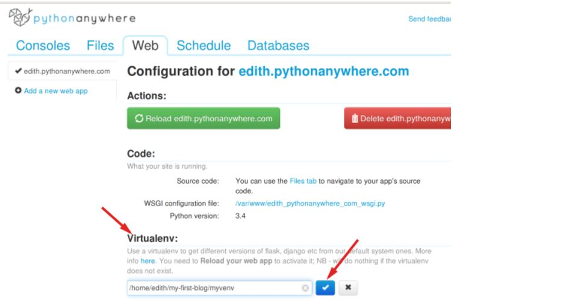

# Django Deployment(배포하기)

* github에 저장소 만들기
  * 우리가 Local 환경에서 작업한 코드들을 github에 저장하기


* PythonAnywhere에 블로그 설정하기

   * 먼저 PythonAnywhere 사이트에 가입을 한다.
   * PythonAnywhere bash 콘솔을 사용하여 django 코드를 저장한 github repository를 `git clone` 명령을 사용하여 복사해온다.
    * `git clone https://github.com/ForwardYH/my-first-blog.git`
   * PythonAnywhere에서도 Local환경과 같이 작동할 수 있게 가상환경(virtualenv)를 생성한다.

    * ```$ virtualenv --python=python3.5 <가상환경 이름>```

    * ```$ source myvenv/bin/activate```

    * ```(myvenv) $ pip install django~=1.10.0```

* PythonAnywhere에서 데이터베이스 생성하기

  * MySQL을 사용하고 있기 때문에 setting.py 파일을 수정해줘야 한다.

    ```
    DATABASES = {
    'default': {
        'ENGINE': 'django.db.backends.mysql',
        'NAME': '<your-PythonAnywhere-Username>$<database name>',
        'USER': '<your-PythonAnywhere-Username>',
        'PASSWORD': '<your-PythonAnywhere-mysql password>',
        'HOST': '<your-PythonAnywhere-Username.mysql.pythonanywhere-services.com',
        'PORT': "3306"
        }
    }
    ```
  * 그리고 bash console에서 mysqlclient를 설치해준다.

    * `pip install mysqlclient`


  * 그리고 local에서 해줬던 것과 같이 server에서도 데이터베이스를 초기화 해준다. 그리고 `createsuperuser`를 사용하여 슈퍼계정을 만든다.

    * ```(myvenv) $ python manage.py migrate```
    * ```(myvenv) $ python manage.py createsuperuser```

* web app으로 블로그 배포하기

  
  
  [이미지 출처] : 'https://tutorial.djangogirls.org/ko/deploy/'

  * PythonAnywhere 대시보드로 와서 <strong>Web</strong>을 클릭하고 <strong>Add a new web app</strong>를 선택.

  * Domain 이름을 확정한 후, 대화창에 <strong>수동설정(manual configuration)</strong>을 클릭. 그 다음 <strong>python 3.5</strong> 선택

  * Virtualenv 섹션에서 `/home/ForwardYH/my-first-blog/myvenv` 로 경로를 설정해준다.

  * WSGI 파일 설정하기(ForwardYH_pythonanywhere_com_wsgi.py)

    ```
    import os
    import sys

    path = '/home/<your-PythonAnywhere-username>/my-first-blog'  # PythonAnywhere 계정으로 바꾸세요.
    if path not in sys.path:
        sys.path.append(path)

    os.environ['DJANGO_SETTINGS_MODULE'] = 'mysite.settings'

    from django.core.wsgi import get_wsgi_application
    from django.contrib.staticfiles.handlers import StaticFilesHandler
    application = StaticFilesHandler(get_wsgi_application())
    ```
    * 이 파일은 PythonAnywhere에게 웹 애플리케이션의 위치와 Django 설정 파일명을 알려주는 역할을 함.

    * `StaticFilesHandler`은 CSS를 다루기 위한 것

    * <strong>저장(Save)</strong>을 누르고 <strong>Web</strong> 탭을 누른다.

    * <strong>Reload(다시 불러오기)</strong>을 누르면 나의 Application을 볼 수 있다.

    # Reference
    - [Djangogirls Tutorial](https://tutorial.djangogirls.org/ko/deploy/)
