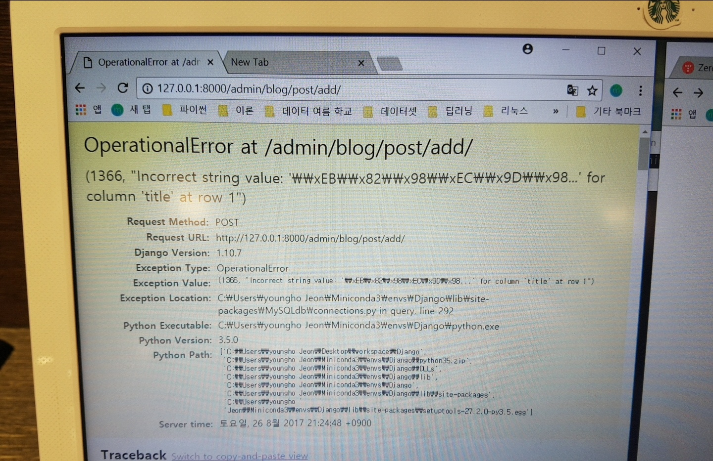
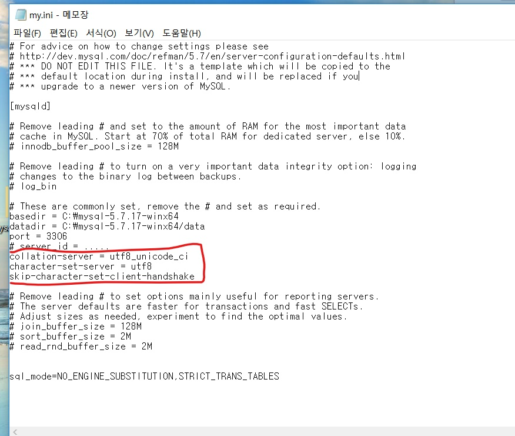

# Django Model

- 어플리케이션 만들기
    * 프로젝트 내부에 별도의 애플리케이션 만들기

    ```python manage.py startapp blog```
    blog 라는 application 생성


- 블로그 글 모델 만들기

```
from django.db import models
from django.utils import timezone


class Post(models.Model):
    author = models.ForeignKey('auth.User')
    title = models.CharField(max_length=200)
    text = models.TextField()
    created_date = models.DateTimeField(
            default=timezone.now)
    published_date = models.DateTimeField(
            blank=True, null=True)

    def publish(self):
        self.published_date = timezone.now()
        self.save()

    def __str__(self):
        return self.title
```

* ```models.CharField``` : 글자 수가 제한된 텍스트를 정의할 때 사용

* ```models.TextField``` : 글자 수가 제한이 없는 긴 텍스트를 위한 속성

* ```models.DateTimeField``` : 날짜와 시간을 의미

* ```models.ForeignKey``` : Many-to-One 관계형을 django에서는 ForeignKey로 정의

  * 모델의 필드와 정의하는 방법 참고 :  [Django Official documents](https://docs.djangoproject.com/en/1.10/ref/models/fields/#field-types)


- 데이터베이스에 모델을 위한 테이블 만들기

  * ```python manage.py makemigrations blog```

    - ```makemigrations``` : models.py에서 적용한 변경사항이나 추가된 혹은 삭제된
사항들을 감지하여 파일로 생성

    - ```makemigrations```와 ```migrate``` 정리
      - ```makemigrations``` : 장고에서 제공하는 모델의 변경사항들을 감지하고 기록하는 역할
      - ```migrate``` : 그렇게 기록된 파일들과 설정값들을 읽어서 그 변경사항을 DB에 저장하는 역할


  * ```python manage.py migrate blog```

- 이 과정 까지 하면 blog 글 모델이 DataBase에 저장된다.

# Django Admin

* Admin.py에 추가

```
from django.contrib import admin
from .models import Post

admin.site.register(Post)
```

* 모든 권한을 가지는 슈퍼 사용자 생성 : createsuperuser


* 처음으로 blog에 글 남기기


* 그리고 나서 blog에 글을 남겨보았다. 에러가 떴다...



* 인코딩 문제를 해결하기 위해 mysql my.ini 파일 설정을 추가했다.



- 하지만 계속 에러가 나서 처음 과정부터 다시 했다. 처음에 mysql서버에서 blog 데이터베이스를 생성할 때 default character set = utf8; 설정을 해주지 않은 것 부터 비롯된 것 같았다.

- 그래서 처음에 blog DB를 만들 때 default를 UTF-8로 설정해주었다.

  ```create database blog default character set=utf8;```

- 그리고 기존에 했던 과정들을 다시 거치고 다시 post에 한글로 된 글을 남겨보았다.


- 결과는 성공적! 에러를 처리하는데 시간이 오래 걸렸지만 그래도 계속 구글링을 하면서 성공적으로 에러를 처리해서 뿌듯하다.

# Reference
- [Djangogirls Tutorial](https://tutorial.djangogirls.org/ko/django_models/)
