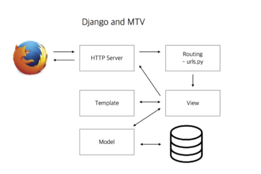

# 장고와 MTV

[파이썬 웹 프로그래밍 - Django로 웹 서비스 개발하기](https://www.inflearn.com/course/django-%ED%8C%8C%EC%9D%B4%EC%8D%AC-%EC%9E%A5%EA%B3%A0-%EA%B0%95%EC%A2%8C/)
* Model, Templete, View

- <mark>Rounting - urls.py</mark>
  - URL을 파싱하고 난 뒤 view로 전달해준다.
- <mark>View</mark>
  - View에서는 URL 규칙을 처리하는 오브젝트 - URL 디스패처
  - MVC의 V와 상관이 없고 오히려 Template이 V에 가깝다.
  - 그리고 Controller도 아니다.
  - 오히려 Controller 역할은 Django 자체가 수행
  - Model로부터 데이터를 수집
- <mark>Model</mark>
  - Model Object는 데이터베이스 조작을 쉽게 해준다
  - ORM
- <mark>Template</mark>
  - 디자인 Layer
  - html, presentation layer
- <mark>DataBase</mark>
  - Data 저장공간, Data를 Persistent하게 읽고 쓰는데 Model 사용  
