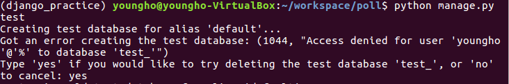
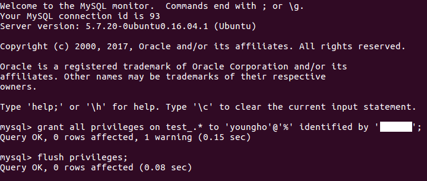

# 버그 수정 및 테스트 자동화

[파이썬 웹 프로그래밍 - Django로 웹 서비스 개발하기](https://www.inflearn.com/course/django-%ED%8C%8C%EC%9D%B4%EC%8D%AC-%EC%9E%A5%EA%B3%A0-%EA%B0%95%EC%A2%8C/)

## 버그 확인하기

```
python manage.py shell
>>>import datetime
>>>from django.utils import timezone
>>>from poll_ex.models import Question
>>>future_question = Question(pub_date=timezone.now() + datetime.timedelta(days=7))
>>>future_question.was_published_recently()
True
```

## 테스트 파일 작성

- poll_ex/tests.py 작성
- 함수명 앞에 test_가 들어가야 함

  ```
  import datetime
  from django.utils import timezone
  from django.test import TestCase

  from .models import Question

  class QuestionMethodTest(TestCase):

      def test_was_published_recently_with_future_question(self):
          time = timezone.now() + datetime.timedelta(days=30)
          future_question = Question(pub_date=time)
          self.assertIs(future_question.was_published_recently(), False)

  ```

## 테스트 실행

- `python manage.py test poll_ex`

- 여기서 에러가 났었다.
  
- 에러 핸들링
  
- 다시 테스트
  - `python manage.py test poll_ex`


## 버그 수정
  - models.py 수정

    ```
    def was_published_recently(self):
        now = timezone.now()
        return now - datetime.timedelta(days=1) <= self.pub_date <= now
    ```
### 더 많은 테스트코드 작성

```
def test_was_published_recently_with_old_question(self):
    """
    was_published_recently() should return False for questions whose
    pub_date is older than 1 day.
    """
    time = timezone.now() - datetime.timedelta(days=30)
    old_question = Question(pub_date=time)
    self.assertIs(old_question.was_published_recently(), False)

def test_was_published_recently_with_recent_question(self):
    """
    was_published_recently() should return True for questions whose
    pub_date is within the last day.
    """
    time = timezone.now() - datetime.timedelta(hours=1)
    recent_question = Question(pub_date=time)
    self.assertIs(recent_question.was_published_recently(), True)
```
