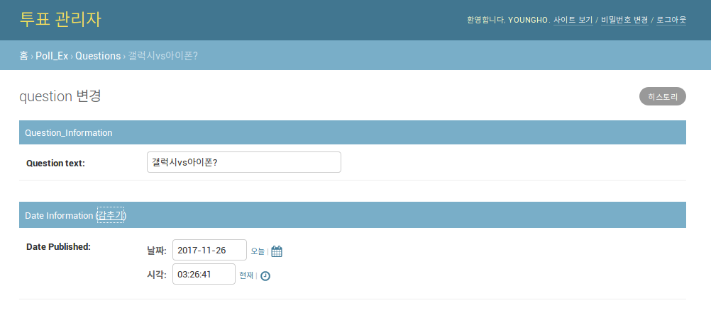
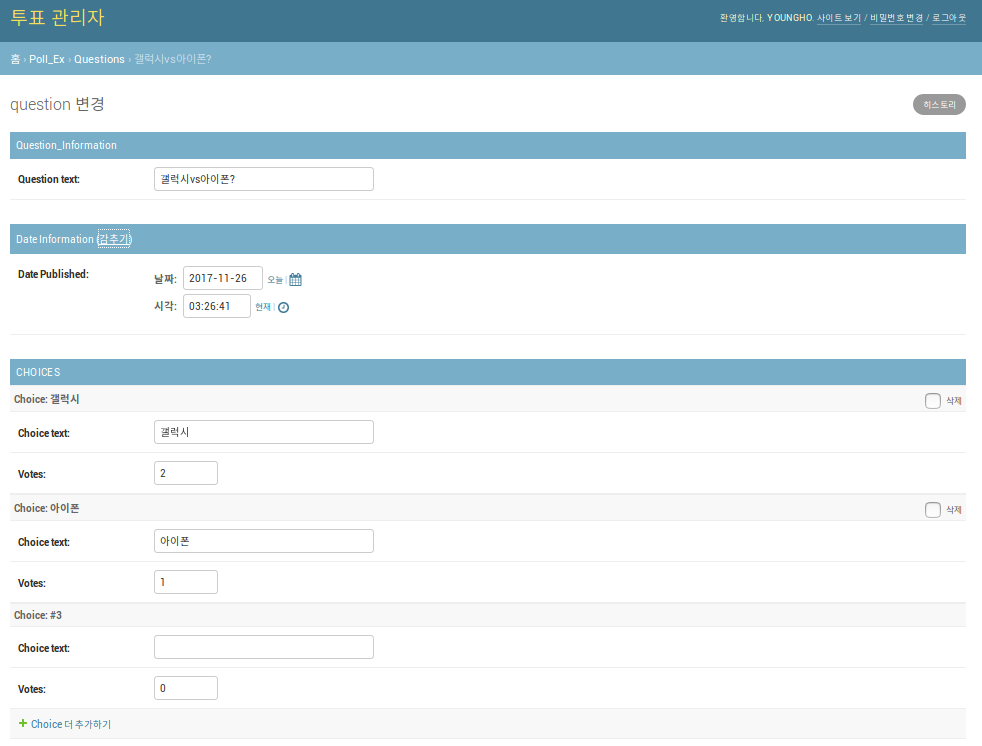
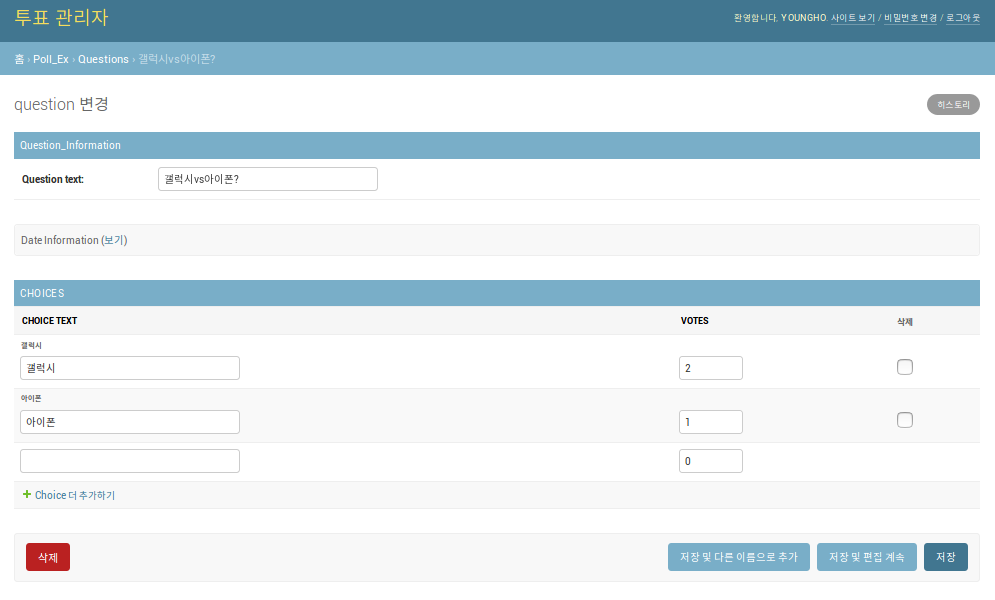
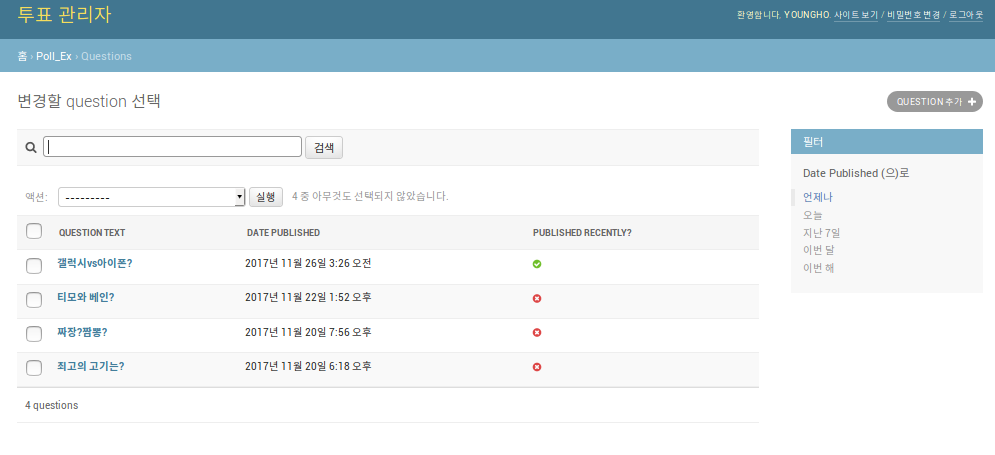

# admin customize

[파이썬 웹 프로그래밍 - Django로 웹 서비스 개발하기](https://www.inflearn.com/course/django-%ED%8C%8C%EC%9D%B4%EC%8D%AC-%EC%9E%A5%EA%B3%A0-%EA%B0%95%EC%A2%8C/)


## admin.py 수정
  - fields를 수정하여 admin 페이지에서 보이는 순서를 바꿀 수 있다.
```
class QuestionAdmin(admin.ModelAdmin):
    fields = ['pub_date', 'question_text']

admin.site.register(Question, QuestionAdmin)
```

### `fieldset`
  - 각 필드를 구분하는 제목 설정 가능
```
class QuestionAdmin(admin.ModelAdmin):
    fieldsets = [
        ('Question_Information', {'fields' : ['question_text']}),
        ('Date Information' : {'fields' : ['pub_date']}),
    ]

```


### `admin.StackedInline`
```
class ChoiceInline(admin.StackedInline):
    model = Choice
    extra = 1

class QuestionAdmin(admin.ModelAdmin):
fieldsets = [
    ('Question_Information', {'fields' : ['question_text']}),
    ('Date Information' : {'fields' : ['pub_date']}),

    inlines = [ChoiceInline] # 해당 클래스 인라인으로 추가
]
```


### `admin.TabularInline, 'classes' : ['collapse']`
```
class ChoiceInline(admin.TabularInline):
    model = Choice

    extra = 1 # 추가 여분 칸 1개 표시

class QuestionAdmin(admin.ModelAdmin):
fieldsets = [
    ('Question_Information', {'fields' : ['question_text']}),
    ('Date Information' : {'fields' : ['pub_date'],
    'classes' : ['collapse']}), # 접기 기능 활성화

    inlines = [ChoiceInline]
]

```


### `list_display`
  - 모델 오브젝트 표시 방법 변경

```
class ChoiceInline(admin.TabularInline):
    model = Choice
    extra = 1

class QuestionAdmin(admin.ModelAdmin):
    fieldsets = [
    ('Question_Information', {'fields' : ['question_text']}),
    ('Date Information' : {'fields' : ['pub_date'],
    'classes' : ['collapse']}),

    inlines = [ChoiceInline]
    ]

    list_display = ('question_text', 'pub_date', 'was_published_recently')
    # display에 보여지는 것들
```

### 정렬, 검색 및 필터 기능 추가

  - `.admin_order_field'` : 모델 오브젝트에 정렬 기능 추가
  - `list_filter`         : 필터링 구현
  - `search_fields`       : 검색기능 구현

  - models.py 수정
    ```
    class Question(models.Model):
        # ...
        def was_published_recently(self):
            now = timezone.now()
            return now - datetime.timedelta(days=1) <= self.pub_date <= now
        was_published_recently.admin_order_field = 'pub_date'
        was_published_recently.boolean = True
        was_published_recently.short_description = 'Published recently?'
    ```

  - admin.py 수정
    ```
    class QuestionAdmin(admin.ModelAdmin):
    ...
        list_display = ('question_text', 'pub_date', 'was_published_recently')
                                          # display에 보여지는 것들
        list_filter = ['pub_date']        # 날짜로 필터링 기능
        search_fields = ['question_text'] # 검색기능 구현
    ```
    
