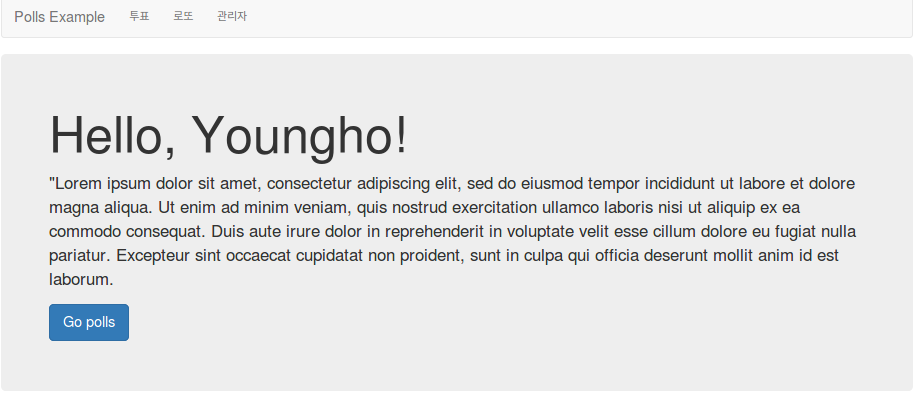
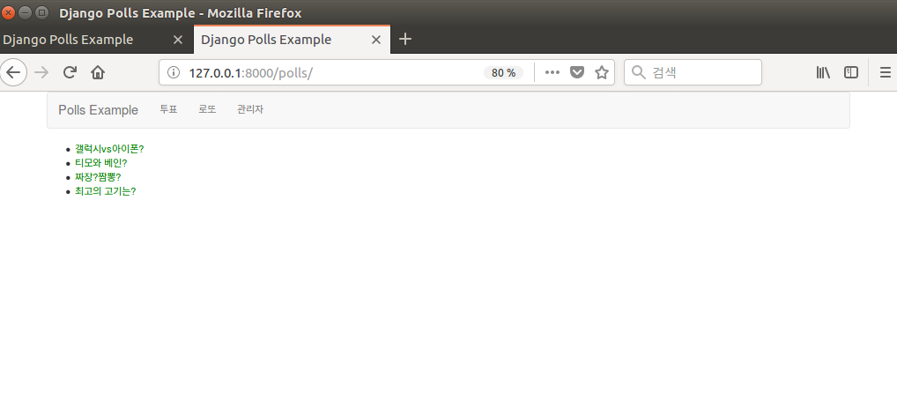

# 정적파일, admin 템플릿 변경 및 템플릿 확장

[파이썬 웹 프로그래밍 - Django로 웹 서비스 개발하기](https://www.inflearn.com/course/django-%ED%8C%8C%EC%9D%B4%EC%8D%AC-%EC%9E%A5%EA%B3%A0-%EA%B0%95%EC%A2%8C/)

## css 파일 만들기
  - `poll_ex/static/poll_ex/style.css`

  ```
  a {
    color: red;
    text-decoration: none;
  }

  body {
      background: white url("images/background.gif") no-repeat right bottom;
  }
  ```

### settings.py 수정
  - `STATIC_ROOT = os.path.join(BASE_DIR, 'static')`
  - static_root 설정하면 해당 경로에 모든 정적파일을 모아둠

### collectstatic 명령 수행

  - 실제 서버에 배포할 때 `collectstatic` 명령을 사용하여 정적인 파일들을 특정 디렉토리에 묶어놓을 수 있음.

### custom admin template

### settings.py 수정
  ```
  INSTALLED_APPS = [
    'poll_ex',
    'django.contrib.admin',
    # ...
  ]

  TEMPLATES = [
      {
          'BACKEND': 'django.template.backends.django.DjangoTemplates',
          'DIRS': [os.path.join(BASE_DIR, 'templates')],
          # ...
      }
  ]
  ```

### 장고 기본 디렉토리 확인
  ```
  >>>import django
  >>>print(django.__path__)
  ```

### poll_ex/templates/admin/base_site.html 생성

- 원본 파일은 django/contrib/admin/templates 에 저장되어 있음

  ```
  

  {{ title }} | {{ site_title|default:_('Django site admin') }}

  
  <h1 id="site-name"><a href="">투표 관리자</a></h1>
  

  

  ```

### 템플릿 확장
  - poll_ex/templates/poll_ex/base.html 생성
```
<!DOCTYPE html>
<html lang="en">
<head>
  <meta charset="utf-8">
  <meta http-equiv="X-UA-Compatible" content="IE=edge">
  <meta name="viewport" content="width=device-width, initial-scale=1">
  <!-- The above 3 meta tags *must* come first in the head; any other head content must come *after* these tags -->
  <title>Django Polls Example</title>

  <!-- Bootstrap -->
  <link href="//maxcdn.bootstrapcdn.com/bootstrap/3.3.7/css/bootstrap.min.css" rel="stylesheet">

  <!-- HTML5 shim and Respond.js for IE8 support of HTML5 elements and media queries -->
  <!-- WARNING: Respond.js doesn't work if you view the page via file:// -->
  <!--[if lt IE 9]>
  <script src="https://oss.maxcdn.com/html5shiv/3.7.3/html5shiv.min.js"></script>
  <script src="https://oss.maxcdn.com/respond/1.4.2/respond.min.js"></script>
  <![endif]-->
</head>
<body>
  <div class="container">
    <nav class="navbar navbar-default">
      <div class="container-fluid">
        <div class="navbar-header">
          <span class="navbar-brand">Polls Example</span>
        </div>
        <ul class="nav navbar-nav">
          <li><a href = "">투표</a></li>
          <li><a href = "">로또</a></li>
          <li class="navbar-right"><a href = "">관리자</a></li>
        </ul>
      </div>
    </nav>
    <div>
      
      
    </div>
  </div>
  <!-- jQuery (necessary for Bootstrap's JavaScript plugins) -->
  <script src="https://ajax.googleapis.com/ajax/libs/jquery/1.12.4/jquery.min.js"></script>
  <!-- Include all compiled plugins (below), or include individual files as needed -->
  <script src="//maxcdn.bootstrapcdn.com/bootstrap/3.3.7/js/bootstrap.min.js"></script>
  </body>
  </html>
```

### 나머지 페이지 수정

   - {% block content} ~  사이에 블럭처럼 끼워 맞출 수 있다.
```



    <!--
        ohter html here
    -->

```



