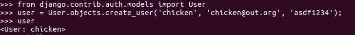
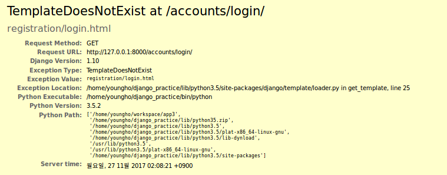
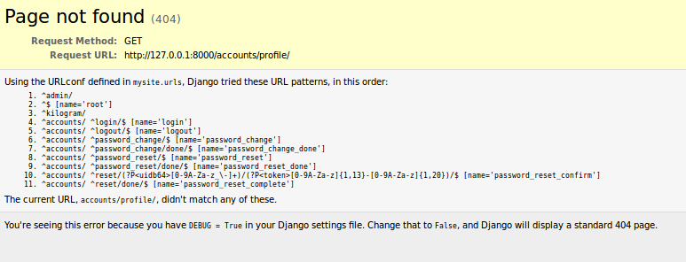

# 로그인과 로그아웃 구현하기

[파이썬 웹 프로그래밍 - Django로 웹 서비스 개발하기](https://www.inflearn.com/course/django-%ED%8C%8C%EC%9D%B4%EC%8D%AC-%EC%9E%A5%EA%B3%A0-%EA%B0%95%EC%A2%8C/)

## css 추가

- 경로 : `kilogram/static/kilogram/style.css`
  ```
  a {
    color: green;
    text-decoration : none;
  }
  ```
  - base.html 템플릿에는 load static 구문이 있는데 load staticfiles 로 고칠 수 있다. [관련 링크](http://stackoverflow.com/questions/24238496/what-is-the-difference-between-load-staticfiles-and-load-static)
  - 이 경우 python manage.py collectstatic 명령을 서버 실행 전에 수행해야 한다.
  - collectstatic 명령을 통해서 최상위 폴더 내 static 폴더에 모든 static 파일이 모인다.
    settings.py 설정 내용 :  STATIC_ROOT = os.path.join(BASE_DIR, 'static')
  - 이는 배포할때 중요한 명령이다.
  - 정적파일은 로컬이 아닌 클라우드 같은 다른 strage에 저장되는 경우가 많다.
  - 그럴 경우에 collectstatic 명령어가 사용된다.

## MVT 순서로 구현해보기
  - 장고는 기본적으로 인증기능을 다 가지고 있다. (Fullframework)
  - django.contrib.auth.model.User 클래스를 그대로 사용
  - model쪽에 특별한 코딩은 필요 없다.
  - url과 연결되어 있는 view도 이미 되어 있기 떄문에 로그인 관련해서 view도 특별히
    만들어줄 필요가 없다.

## 프로젝트 폴더 내 urls.py 수정
  ```
  urlpatterns = [
      ...
      url(r'^accounts/', include('django.contrib.auth.urls')),
      #장고에 기본으로 내장된 인증 기능을 활용

  ]
  ```
  - auth.urls를 include하면 아래와 같은 url들이 포함됨.
  ```
  ^login/$ [name='login']
  ^logout/$ [name='logout']
  ^password_change/$ [name='password_change']
  ^password_change/done/$ [name='password_change_done']
  ^password_reset/$ [name='password_reset']
  ^password_reset/done/$ [name='password_reset_done']
  ^reset/(?P<uidb64>[0-9A-Za-z_\-]+)/(?P<token>[0-9A-Za-z]{1,13}-[0-9A-Za-z]{1,20})/$ [name='password_reset_confirm']
  ^reset/done/$ [name='password_reset_complete']
  ```

## view 만들기
- url과 연결되어 있는 view도 이미 되어 있기 떄문에 로그인 관련해서 view도 특별히
  만들어줄 필요가 없다.
- login 관련 기능에는 별도로 view를 작성할 필요 없이 템플릿만 작성하면 된다.


## template 만들기
- 로그인과 로그아웃에 사용할 템플릿을 만듭니다. 경로와 이름이 이미 정해져 있는데 로그인은 만들지 않으면 에러가  발생하고, 로그 아웃은 관리자용 페이지를 사용합니다. 둘 다 모두 직접 만들어 주는 것이 좋다.

  - 기본 base.html 수정
    - 로그인 및 로그아웃 링크를 추가. 로그인한 상태와 로그인하지 않은 상태에서 보여줄 링크도 변경.
    ```
    <ul class="nav navbar-nav navbar-right">
       <!-- 유저가 로그인 했을 경우 -->
      <li><a href=""> <span class="glyphicon glyphicon-heart">
        </span> {{user.username}}</a></li>
      <li><a href="">Logout</a></li> <!--로그인 할 경우에만 로그아웃 보여주기-->
      
      <li><a href=""> <span class="glyphicon glyphicon-user"></span>
      Login</a></li>
      <li><a href="">Admin</a></li>
      
    </ul>
    ```
## Shell에서 User 만들어보기


## 웹에서 로그인 해보기
- 그러나 로그인 에러가 뜬다.


  - 로그인 템플릿을 만들어야 한다. `kilogram/templates/registration/login.html`

  - login.html 생성
    - 사용자가 로그인 했을 경우 사용자 정보 표시
    - 그렇지 않으면 로그인 폼이 나옴
    - 로그인을 해서 post 메시지를 같은 url에 보냄
    - 로그인을 하면 다음 페이지로 넘어감

  ```
   <!-- template 확장-->
  

   <!-- 사용자가 로그인 했다면 -->
  <h2> Welcome, {{user.username}} </h2> <!-- 사용자 정보 보여주기 -->
  <a href="">로그아웃</a>

  
  
  <p>ID나 비밀번호가 일치하지 않습니다.</p>
  

  <form method="post" action="">
  
  <input type="hidden" name="next" value="" />
  {{ form.as_p }}
  <button type="submit">로그인</button>
  </form>

  

  
  ```

- 다시 로그인을 시도 : 하지만 또 다른 에러
  - 로그인을 성공적으로 하면 /accounts/profile로 리다이렉트 되도록 default 되어 있음.
  - 이를 변경하기 위해 settings.py 수정


## settings.py 수정

```
...
# Auth settings
LOGIN_REDIRECT_URL = '/kilogram/' # 로그인이 되면 kilogram 페이지로 리다이렉트 되도록 설정
```

## 로그아웃 템플릿 만들기
- 로그아웃용 파일입니다. 템플릿 이름이 다르면 안된다.
- 파일이름은 장고 소스의 auth.views.logout()을 보면 확인 가능
- 경로 : `kilogram/templates/registration/logged_out.html`

```
...



<h2> 잘 가요, 안녕. </h2>
<p><a href="">다시 로그인하기</a></p>


```
