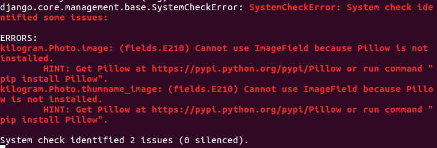

# Photo 모델 생성 & MEDIA_URL 설정

[파이썬 웹 프로그래밍 - Django로 웹 서비스 개발하기](https://www.inflearn.com/course/django-%ED%8C%8C%EC%9D%B4%EC%8D%AC-%EC%9E%A5%EA%B3%A0-%EA%B0%95%EC%A2%8C/)

### media url 설정하기

```
# mysite/settings.py 수정

# Media files
MEDIA_URL = '/files/'
MEDIA_ROOT = os.path.join(BASE_DIR, 'uploads')
```

### Photo 모델 생성

```
def user_path(instance, filename):
    '''
    instance : Photo Model object(객체)
    filename : 업로드한 파일의 이름
    '''
    from random import choice
    import string
    arr = [choice(string.ascii_letters) for _ in range(8)]
    pid = ''.join(arr) #무작위 8개 문자열 join
    extension = filename.split('.')[-1] # 파일 확장자만 가져오기
    return '%s/%s.%s' % (instance.owner.username, pid, extension)
    # youngho/abcde.png
    # file will be uploaded to MEDIA_ROOT/user_<id>/<random>


class Photo(models.Model):
    image = models.ImageField(upload_to = user_path)
    owner = models.ForeignKey(settings.AUTH_USER_MODEL)
    # 장고의 auth 모델 사용 = settings.AUTH_USER_MODEL 사용
    # 장고에서 권하는 방법
    # 사진은 소유자가 올리는것 소유자는 사진을 여러장 올릴 수 있음. 1:N관계
    # ManytoOne 모델 Photo는 Many 사용자는 One : ForeignKey
    thumbnail_image = models.ImageField(blank=True) #선택항목이 됨
    comment = models.CharField(max_length = 255)
    pub_date = models.DateTimeField(auto_now_add=True) #자동으로 date setting
```

### Pillow 설치
- 에러 뜸 : Pillow 설치하라고 에러뜬다!

- `pip install Pillow`


### Model 변경사항 migrate 하기

- `python manage.py makemigrations`
- `python manage.py migrate`


### admin에 등록

```
# kilogram/admin.py

from .models import Photo

# Register your models here.
admin.site.register(Photo)`
```

### media url 을 static url로 설정하기

```
# mysite/urls.py

from django.conf import settings
from django.conf.urls.static import static

urlpatterns += static(settings.MEDIA_URL, document_root=settings.MEDIA_ROOT)
```
