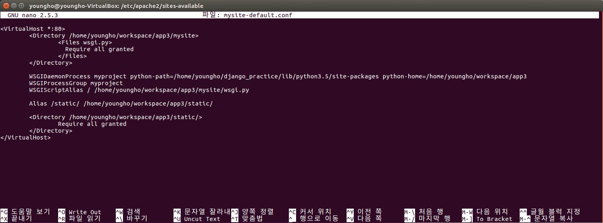

# Django와 Apache2 연동
  - django version : 1.10

## 패키지 설치
- `sudo apt-get install apache2`
- `sudo apt-get install libapache2-mod-wsgi-py3`
  - 사용하는 파이썬 버전 : `python 3.5.2`

## 아파치 웹서버 잘 돌아가는지 확인
- `ps -aux | grep apache2` 로 확인

- 아파치 서버 시작 : `sudo service apache2 start`
- 아파치 서버 중단 : `sudo service apache2 stop`
- 아파치 서버 재시작 : `sudo service apache2 restart`


## 아파치 설정 파일 수정

  - `sudo nano /etc/apache2/sites-available/mysite_default.conf`
    - nano 에디터로 sites-available 폴더에 있는 000-default.conf가 아니라
      mysite_default.conf를 만들어서 적용

  - 설정 파일 예시

  

  - `<Directory project-path> ~ </Directory>` : 아파치가 wsgi.py 파일을 액세스할 수 있도록 mysite 디렉토리 및 wsgi.py 파일에 대한 접근 권한을 설정

  - `WSGIDaemonProcess` : 데몬 프로세스에서 장고를 실행하기 위해 설정
    - python-path : 가상환경이 설치되어 있는 폴더에서 /lib/python3.5/site-packages
    - python-home : 프로젝트 파일이 있는 경로

  - `WSGIProcessGroup` : 프로세스 그룹 지정. 동일한 프로세스 그룹에 할당된 Application은 같은 데몬 프로세스에서 실행

  - `WSGIScriptAlias` : 아파치 웹서버로 서비스하는 URL(/)과 wsgi.py 파일의 위치 매핑 루트(/) URL로 시작하는 모든 요청은 wsgi.py파일에서 정의된 WSGI application에서 처리한다는 의미

  - `Alias /static/ /path/static/ ~ <Directory static경로> ~ </Directory>`
    - /static/ URL에 대한 처리를 위해 static 파일이 위치한 디렉토리 매핑
    - static 경로는 collectstatic 명령으로 static파일들을 모아둔 위치
    - settings.py에서 STATIC_ROOT 항목에 정의된 디렉토리
    - 아파치가 static 디렉토리에 접근할 수 있도록 디렉토리 접근 권한 설정
    - 적용시키면 django-admin 페이지에서 css가 적용되지 않던 오류가 해결된다.


## 아파치 Configuration 파일 수정 후

- 000-default.conf는 적용시킬 필요 없음.
  - `sudo a2dissite 000-default.conf`
- mysite_default.cnf 파일 적용
  - `sudo a2ensite mysite_default.conf`
- 아파치 서버 재시작
  - `sudo service apache2 restart`

## settings.py 수정

```
...
ALLOWED_HOSTS = ['127.0.0.1', 'localhost']
...
```

## wsgi.py 수정
  - 가상환경을 사용하기 때문에 수정해줘야 한다.

```
import os
import sys
path = os.path.abspath(__file__+'/../..') # path : 프로젝트 경로
if path not in sys.path:  # sys.path에 path가 없다면
    sys.path.append(path) # 경로 추가

from django.core.wsgi import get_wsgi_application

os.environ.setdefault("DJANGO_SETTINGS_MODULE", "mysite.settings")

application = get_wsgi_application()
```

  - 그리고 다시 아파치 서버 재시작
    - `sudo service apache2 restart`


<p>

- Reference
  - Django로 배우는 쉽고 빠른 웹 개발 파이썬 웹 프로그래밍
  - 구글링

</p>
