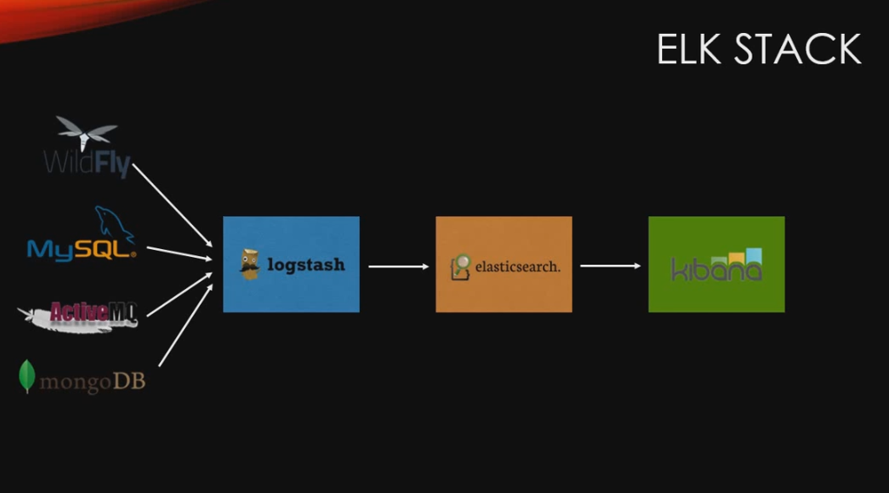
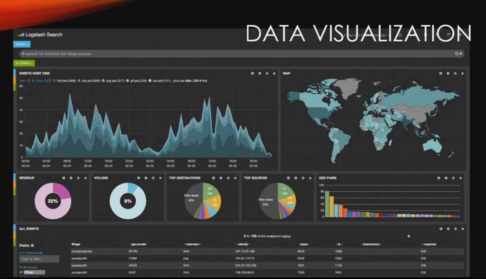

# 데이터 과학 소개

[ELK 스택 (ElasticSearch, Logstash, Kibana) 으로 데이터 분석](https://www.inflearn.com/course/elk-%EC%8A%A4%ED%83%9D-%EB%8D%B0%EC%9D%B4%ED%84%B0-%EB%B6%84%EC%84%9D/)

## ELK 스택

- E : Elasticsearch :
- L : Logstash
- K : Kibana

## ELK

- 어떤 데이터든지 수집하고 빠르게 검색하고 데이터 무더기에서 쓸만한 정보를 시각화할 수 있다. ELK스택을 이용하여!
## Logstash
- Logstash가 어떤 데이터베이스의 데이터든지 데이터를 elasticsearch에 수집해줌

## Elasticsearch
- 엘라스틱(elastic)에서 개발한 엘라스틱서치(elasticsearch)는 루씬 기반의 분산 검색 엔진

## Kibana

- Kibana는 데이터 Visualization tool. Elasticsearch의 데이터를 보기좋게 화면에 보여줄 것이다.
