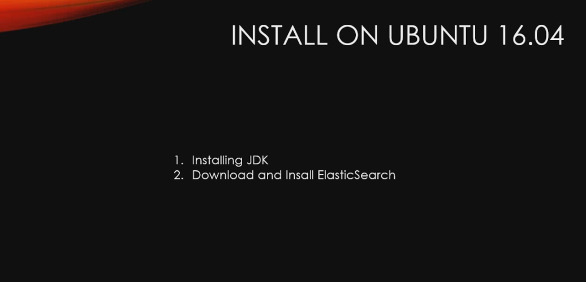

## 우분투에 엘라스틱 서치 설치하기

[ELK 스택 (ElasticSearch, Logstash, Kibana) 으로 데이터 분석](https://www.inflearn.com/course/elk-%EC%8A%A4%ED%83%9D-%EB%8D%B0%EC%9D%B4%ED%84%B0-%EB%B6%84%EC%84%9D/)

# 설치 과정



## Install JAVA8
```
sudo add-apt-repository -y ppa:webupd8team/java
sudo apt-get update
sudo apt-get -y install oracle-java8-installer
java -version
```

## Install Elasticsearch
```
wget https://artifacts.elastic.co/downloads/elasticsearch/elasticsearch-6.0.0.deb
dpkg -i elasticsearch-6.0.0.deb
sudo systemctl enable elasticsearch.service
```

- Install path: /usr/share/elasticsearch
- Config file: /etc/elasticsearch
- Init script: /etc/init.d/elasticsearch

## ELASTICSEARCH Start | Stop | Check
```
sudo service elasticsearch start
sudo service elasticsearch stop
curl -XGET 'localhost:9200' # check if elasticsearch run
```
