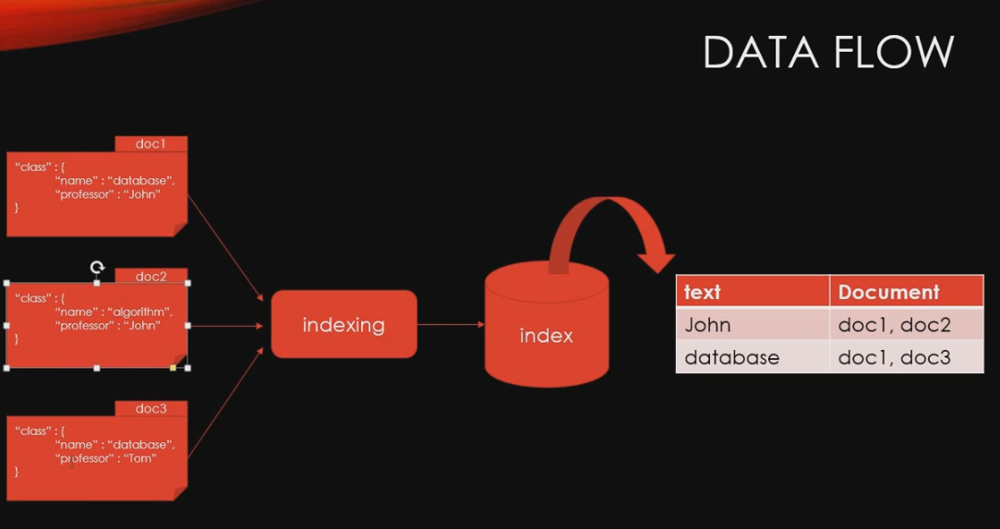
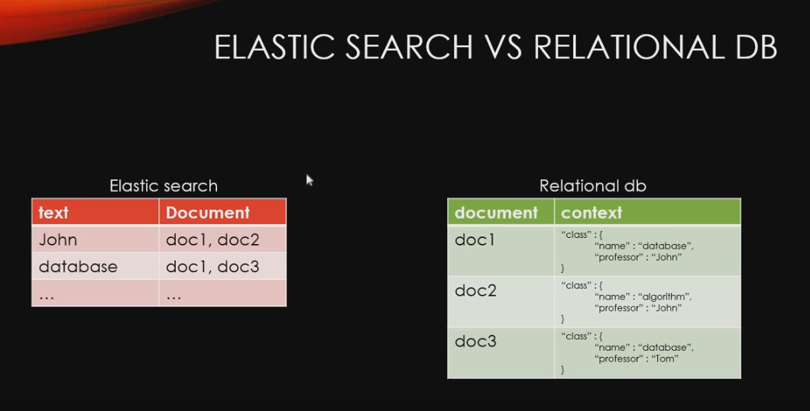
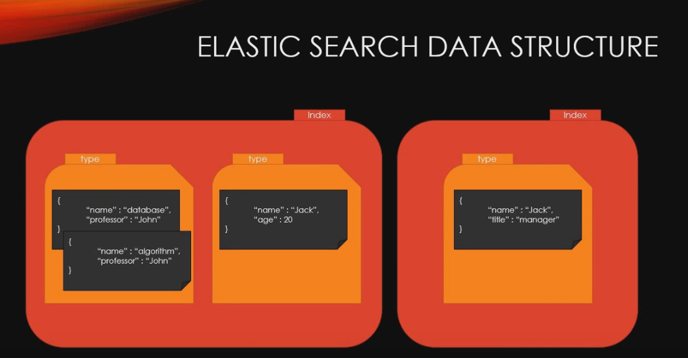
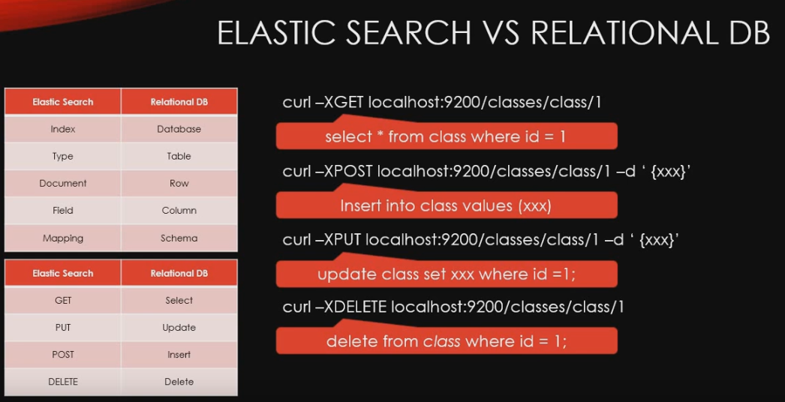

# 엘라스틱서치 기본 개념 정리

[ELK 스택 (ElasticSearch, Logstash, Kibana) 으로 데이터 분석](https://www.inflearn.com/course/elk-%EC%8A%A4%ED%83%9D-%EB%8D%B0%EC%9D%B4%ED%84%B0-%EB%B6%84%EC%84%9D/)

## Data Flow

## ElasticSearch vs RDB

- elasticsearch는 keyword가 어떤 document에 있다고만 저장
- RDB는 전부 다 저장
- Elastic search : hashtable과 같음
- elasticsearch가 search라는 관점에서 봤을 때 매우 빠르다.

- elasitsearch에서는 REST API를 사용하여 CRUD 사용 가능
  - GET, PUT, POST, DELETE
