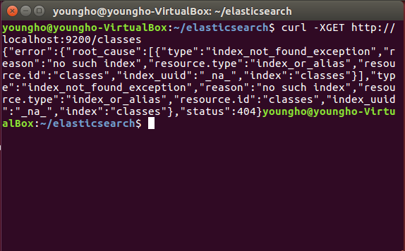
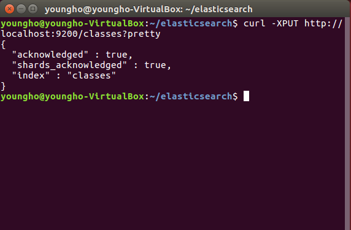
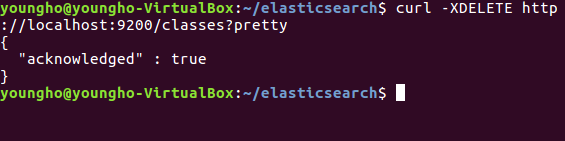
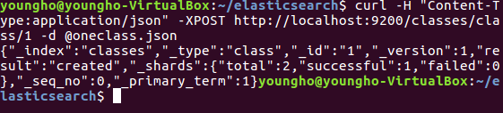

# ElasticSearch (GET, POST, PUT, DELETE)

[ELK 스택 (ElasticSearch, Logstash, Kibana) 으로 데이터 분석](https://www.inflearn.com/course/elk-%EC%8A%A4%ED%83%9D-%EB%8D%B0%EC%9D%B4%ED%84%B0-%EB%B6%84%EC%84%9D/)

| Elasticsearch| RDB   |
| :-------- | :------- |
| Index     | DataBase |
| Type      | Table    |
| Document  | Row      |
| Field     | Column   |
| Mapping   | Schema   |

| Elasticsearch| RDB   | CRUD |
| :-------- | :------- |------|
| GET       | Select   | Read |
| POST      | Insert   | create|
| PUT       | Update   | update|
| DELETE    | Delete   | delete|

## Index 만들기 : Create Index(DataBase)

- Index가 있는지 없는지부터 확인. (classes라는 index가 있는가?)

  - `curl -XGET http://localhost:9200/classes`
  - 인덱스가 없다면?

- classes라는 index 생성 (RDB에서는 DataBase)
  - `curl -XPUT http://localhost:9200/classes?pretty`
  

- 좀 더 깔끔하게 표현하기 위해 `?pretty` 붙여서 사용

## Index 지우기 : Delete
- `curl -XDELETE http://localhost:9200/classes?pretty`

  

## Document 만들기  
  - index가 있을 때 만들어도 됨
  - index가 없을 때 만들어도 됨
    - 단 index name과 type name을 명시해줘야 함.
    - index name : Database Name
    - type name : table Name

- `curl -H "Content-Type:application/json"
      -XPOST http://localhost:9200/classes/class/1/?pretty -d '
      {"title" : "Algorithm", "professor" : "John"} '`

- classes라는 index, class라는 type, id=1인
  document(row) { "title" : Algorithm, "professor" : "John"}을 만들어라

- 만약 파일이 있다면?

- `curl -H "Content-Type:application/json"
  -XPOST http://localhost:9200/classes/class/1/ -d @oneclass.json`
