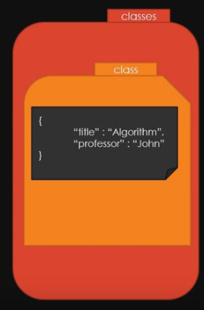
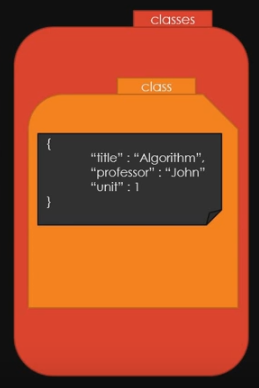
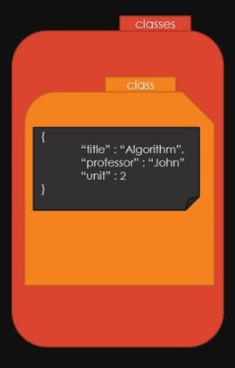
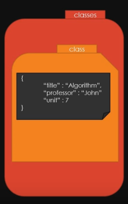

# ElasticSearch UPDATE

[ELK 스택 (ElasticSearch, Logstash, Kibana) 으로 데이터 분석](https://www.inflearn.com/course/elk-%EC%8A%A4%ED%83%9D-%EB%8D%B0%EC%9D%B4%ED%84%B0-%EB%B6%84%EC%84%9D/)

### 먼저 UPDATE를 해야할 Document를 하나 생성

- `curl -H "Content-Type:applicaton/json"
-XPOST http://localhost:9200/classes/class/1/ -d '
{"title" : "Algorithm", "professor" : "John"}'`

- 현재 구조
   

### 제대로 만들어졌는지 확인

- `curl -XGET http://localhost:9200/classes/class/1/?pretty`

### 하나의 Field 추가

- `curl -H "Content-Type:application/json"
  -XPOST http://localhost:9200/classes/class/1/_update -d '
  {"doc" {"unit" : 1}}'`

- 현재 구조
  

### unit 수정 -> 2

- `curl -H "Content-Type:application/json"
  -XPOST http://localhost:9200/classes/class/1/_update -d '
  {"doc" {"unit" : 2}}'`

- 현재 구조
  

### update하는 다른 방법?

- `curl -H "Content-Type:application/json"
  -XPOST http://localhost:9200/classes/class/1/_update -d '
  {"script" : "ctx._source.unit +=5"}`

- 현재 구조
  
