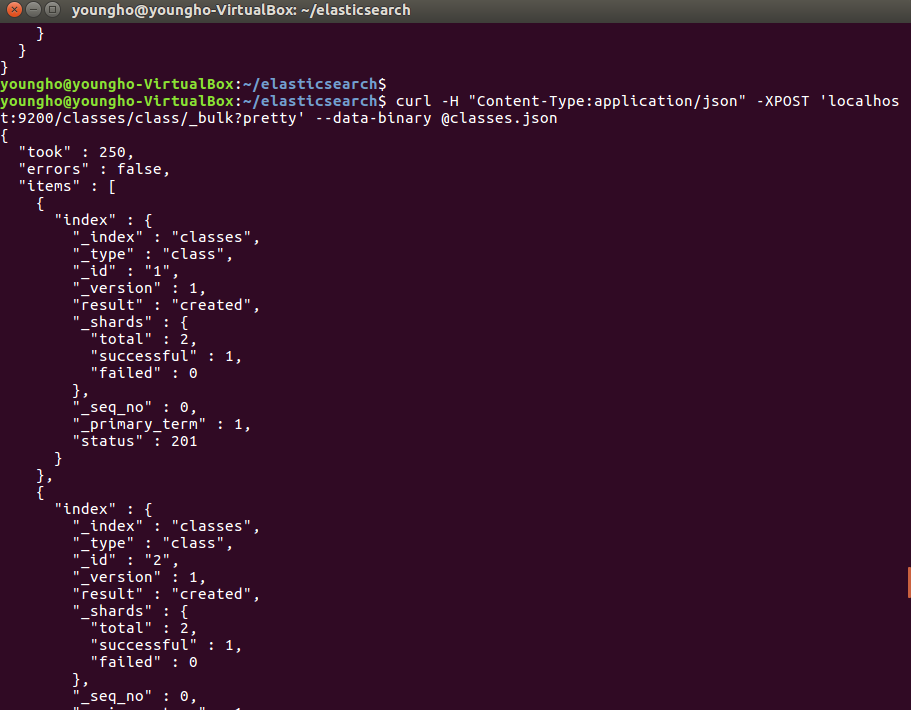

# Elasticsearch - Bulk

[ELK 스택 (ElasticSearch, Logstash, Kibana) 으로 데이터 분석](https://www.inflearn.com/course/elk-%EC%8A%A4%ED%83%9D-%EB%8D%B0%EC%9D%B4%ED%84%B0-%EB%B6%84%EC%84%9D/)

## 한꺼번에 많은 Document index에 추가하기

- `curl -H "Content-Type:application/json" -XPOST 'localhost:9200/classes/class/_bulk?pretty' --data-binary @classes.json`

