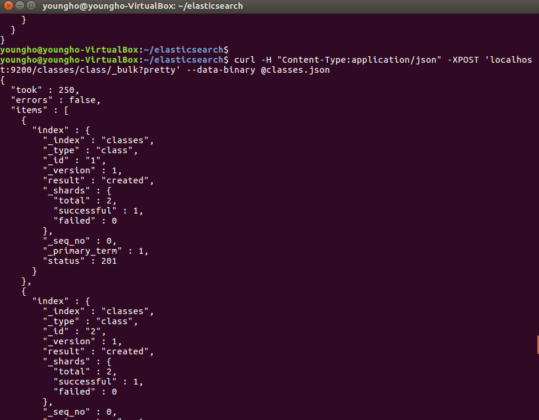

# Elasticsearch - Mapping

[ELK 스택 (ElasticSearch, Logstash, Kibana) 으로 데이터 분석](https://www.inflearn.com/course/elk-%EC%8A%A4%ED%83%9D-%EB%8D%B0%EC%9D%B4%ED%84%B0-%EB%B6%84%EC%84%9D/)

## Mapping(Schema)

- 매핑없이 엘라스틱서치에 데이터를 넣을 수 있을까?
  - 넣을 수는 있지만 상당히 위험한 일이다
  - document에 date를 넣는다고 했을 때 elasticsearch가 mapping이 없다면 그것이 날짜인지 아닌지 모름. 단순히 문자열로 저장할 수 있다.
  - 또는 숫자를 넣을 때 숫자인지 문자인지 구별이 잘 안갈 때 엘라스틱 서치는 숫자를 문자로 넣을 수 있음.
  - 이와 같이 잘못 지정된 타입같은 경우 Kibana와 같이 시각화할 때 원하지 않는 결과가 나올 수 있다.  

- 항상 데이터를 관리할 때는 Mapping을 먼저 추가하자
- 혹은 데이터가 이미 있을 때는 Mapping을 추후에 추가하자
  - 분석이나 시각화 할 때 도움!

## Mapping 하기

- 먼저 index를 만들기(없다면)
   - `curl -XPUT 'localhost:9200/classes?pretty'`

- Mapping
   - `curl -H "Content-Type:application/json" -XPUT 'localhost:9200/classes/class/_mapping?pretty' -d @classesRating_mapping.json`

- Mapping이 제대로 추가 되었는지 확인
  - `curl -XGET 'localhost:9200/classes?pretty'`

- 매핑을 한 후 벌크로 한번에 많은 document를 추가

- 엘라스틱서치 공식 홈페이지에서 field data type확인
[Elasticsearch Reference 6.0 Field Data type](https://www.elastic.co/guide/en/elasticsearch/reference/6.0/mapping-types.html)
