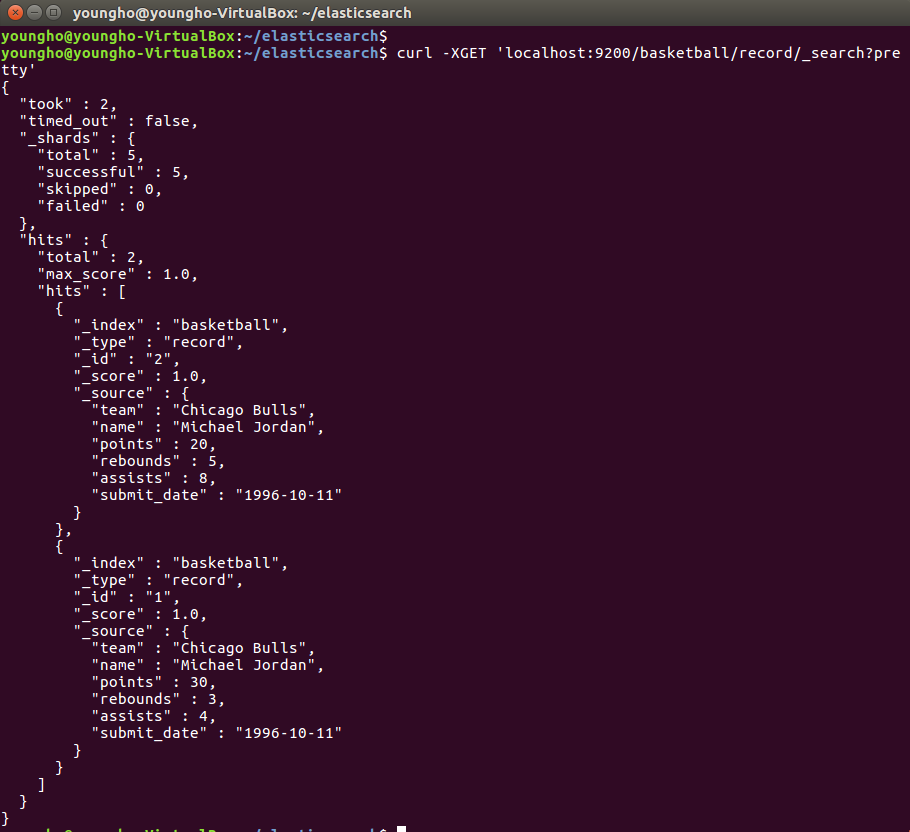
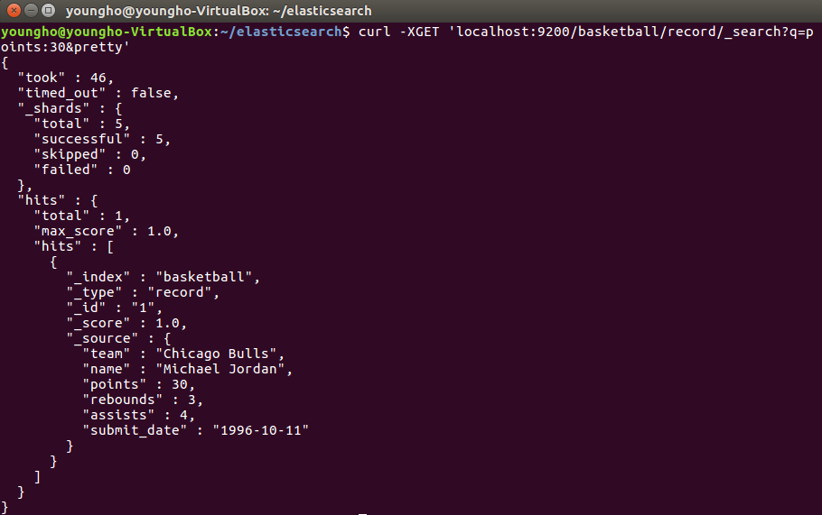
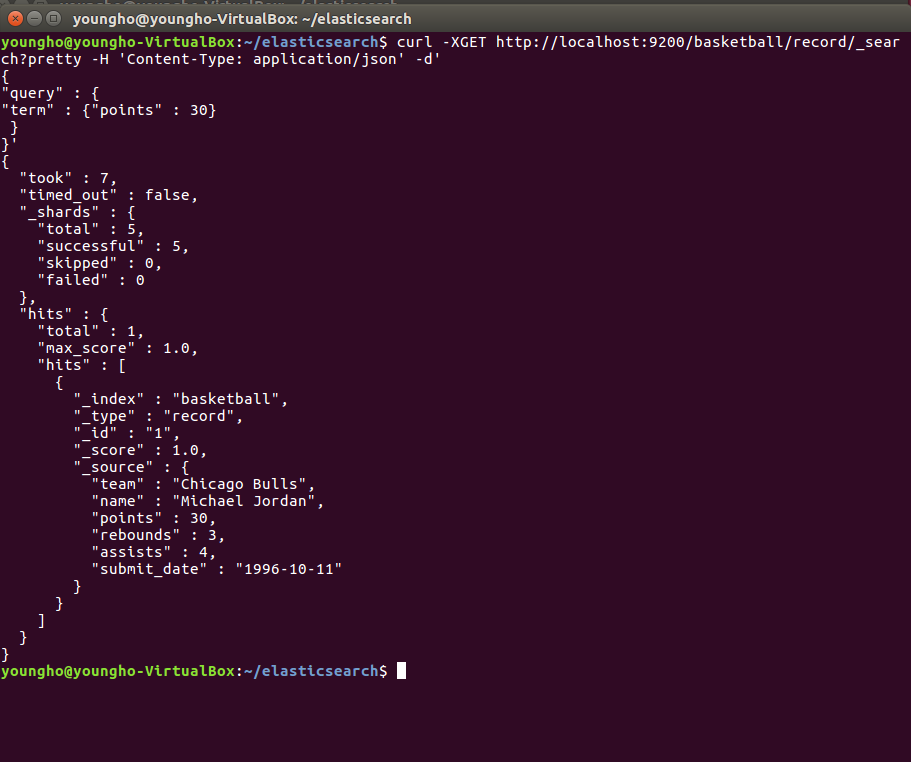

# Elasticsearch - Mapping

[ELK 스택 (ElasticSearch, Logstash, Kibana) 으로 데이터 분석](https://www.inflearn.com/course/elk-%EC%8A%A4%ED%83%9D-%EB%8D%B0%EC%9D%B4%ED%84%B0-%EB%B6%84%EC%84%9D/)

## Search

- 먼저 document를 add 해준다.
  - `curl -H "Content-Type:application/json" -XPOST 'localhost:9200/baksetball/record/_bulk?pretty' --data-binary @simple_basketball.json'`

  - 그리고 나서 데이터 조회(search)를 한다.

    - `curl -XGET 'localhost:9200/basketball/record/_search?pretty'`

    

## Search - URI

- `curl -XGET 'localhost:9200/baksetball/record/_search?q=points:30&pretty'`

    

## Search - Request Body

- `curl -XGET localhost:9200/basketball/record_search?pretty -H "Content-Type:application/json" -d'
{
  "query" : {
    "term" : { "points" : 30}
  }
}'`

  
