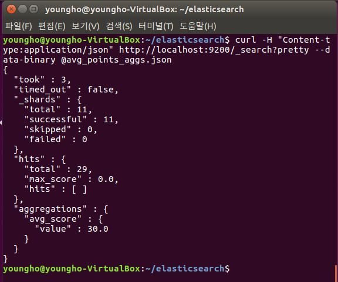
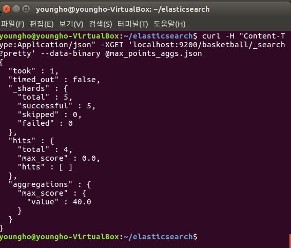
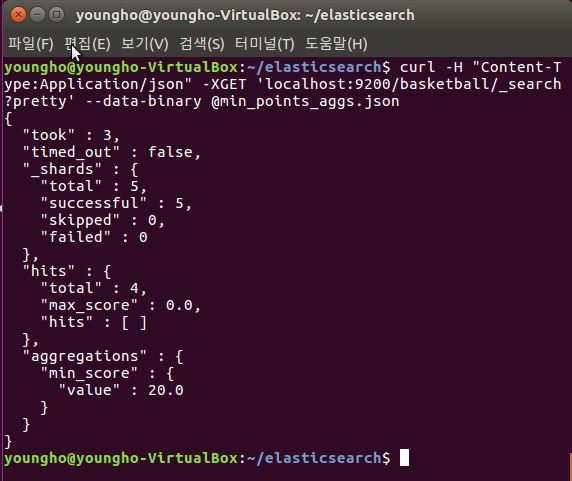
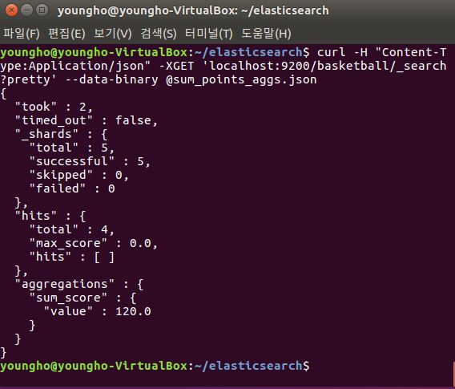
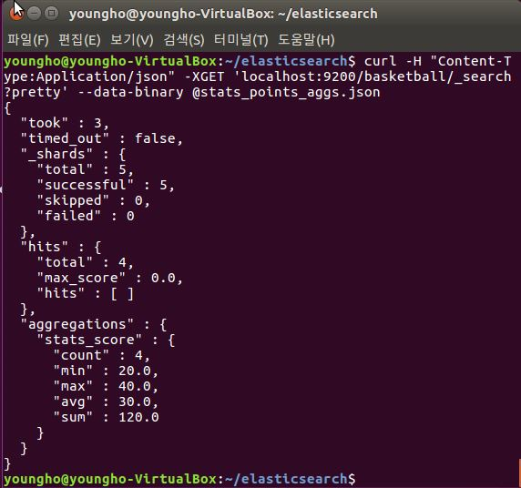

# Elasticsearch - Metric Aggregation

[ELK 스택 (ElasticSearch, Logstash, Kibana) 으로 데이터 분석](https://www.inflearn.com/course/elk-%EC%8A%A4%ED%83%9D-%EB%8D%B0%EC%9D%B4%ED%84%B0-%EB%B6%84%EC%84%9D/)

# Average

```
# avg_points_aggs.json

{
  "size": 0, # 여러개의 정보가 도출되는 것 대신에 우리가 원하는 정보만 도출하기 위해서
  "aggs": {
    "avg_score": {
      "avg": {
        "field": "points"
      }
    }
  }
}
```

- basketball index의 points 필드의 평균 구하기
  - `curl -H "Content-Type:Application/json" -XGET 'localhost:9200/baksetball/_search?pretty' --data-binary @avg_points_aggs.json`

  

# Max

```
# max_points_aggs.json

{
  "size": 0,
  "aggs": {
    "max_score": {
      "max": {
        "field": "points"
      }
    }
  }
}

```

- basketball index의 points 필드의 가장 큰 포인트 값 구하기
  - `curl -H "Content-Type:Application/json" -XGET 'localhost:9200/basketball/_search?pretty' --data-binary @max_points.json`

  

# Min

```
# min_points_aggs.json

{
  "size": 0,
  "aggs": {
    "min_score": {
      "min": {
        "field": "points"
      }
    }
  }
}
```

- basketball index의 points 필드의 가장 작은 포인트 값 구하기
  - `curl -H "Content-Type:Application/json" -XGET 'localhost:9200/basketball/_search?pretty' --data-binary @min_points_aggs.json`

  

# Sum

```
# sum_points_aggs.json

{
  "size": 0,
  "aggs": {
    "sum_score": {
      "sum": {
        "field": "points"
      }
    }
  }
}
```

- basketball index의 points 필드의 포인트 값 모두 합하기
  - `curl -H "Content-Type:Application/json" -XGET 'localhost:9200/basketball/_search?pretty' --data-binary @sum_points_aggs.json`

  

# Stats

```
# stats_points_aggs.json

{
  "size": 0,
  "aggs": {
    "stats_score": {
      "stats": {
        "field": "points"
      }
    }
  }
}
```

  - 평균, 합, 최대, 최소 한번에 출력

  - basketball index의 points 필드 통계값 출력
    - `curl -H "Content-Type:Application/json" -XGET 'localhost:9200/basketball/_search?pretty' --data-binary @stats_points_aggs.json`

    
