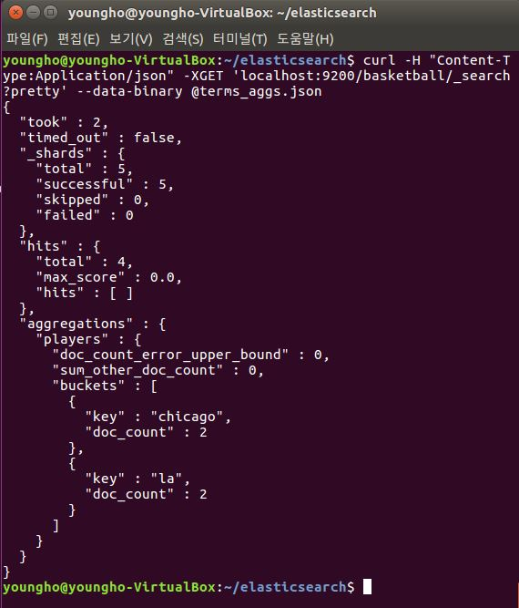
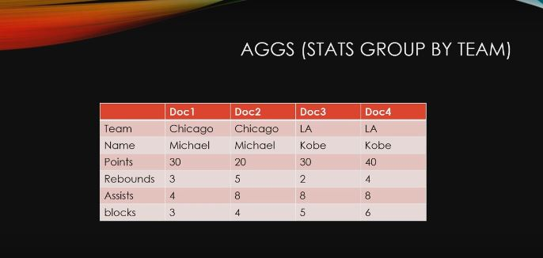
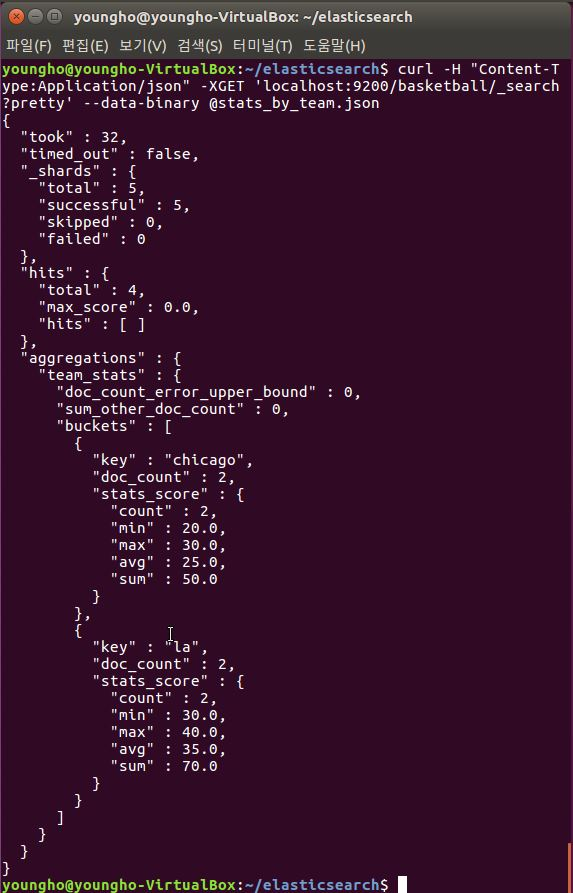

# Elasticsearch - Bucket Aggregation

[ELK 스택 (ElasticSearch, Logstash, Kibana) 으로 데이터 분석](https://www.inflearn.com/course/elk-%EC%8A%A4%ED%83%9D-%EB%8D%B0%EC%9D%B4%ED%84%B0-%EB%B6%84%EC%84%9D/)

- Metric은 산술평균이였다면, Bucket은 Group by

## 먼저 Index가 없다면 인덱스 생성

- `curl -XPUT 'localhost:9200/basketball?pretty'`


## 그리고 매핑 추가
```
# classesRating_mapping.json

{
	"class" : {
		"properties" : {
			"title" : {
				"type" : "text"
			},
			"professor" : {
				"type" : "text"
			},
			"major" : {
				"type" : "text"
			},
			"semester" : {
				"type" : "text"
			},
			"student_count" : {
				"type" : "integer"
			},
			"unit" : {
				"type" : "integer"
			},
			"rating" : {
				"type" : "integer"
			},
			"submit_date" : {
				"type" : "date",
				"format" : "yyyy-MM-dd"
			},
			"school_location" : {
				"type" : "geo_point"
			}
		}
	}
}

```
- `curl -H "Content-Type:Application/json" -XPUT 'localhost:9200/basketball/record/_mapping?pretty' -d @classesRating_mapping.json `


## 그리고 Add Document

```
# twoteam_basketball.json

{ "index" : { "_index" : "basketball", "_type" : "record", "_id" : "1" } }
{"team" : "Chicago","name" : "Michael Jordan", "points" : 30,"rebounds" : 3,"assists" : 4, "blocks" : 3, "submit_date" : "1996-10-11"}
{ "index" : { "_index" : "basketball", "_type" : "record", "_id" : "2" } }
{"team" : "Chicago","name" : "Michael Jordan","points" : 20,"rebounds" : 5,"assists" : 8, "blocks" : 4, "submit_date" : "1996-10-13"}
{ "index" : { "_index" : "basketball", "_type" : "record", "_id" : "3" } }
{"team" : "LA","name" : "Kobe Bryant","points" : 30,"rebounds" : 2,"assists" : 8, "blocks" : 5, "submit_date" : "2014-10-13"}
{ "index" : { "_index" : "basketball", "_type" : "record", "_id" : "4" } }
{"team" : "LA","name" : "Kobe Bryant","points" : 40,"rebounds" : 4,"assists" : 8, "blocks" : 6, "submit_date" : "2014-11-13"}
you

```
- `curl -H "Content-Type:application/json" -XPOST 'localhost:9200/_bulk?pretty' --data-binary @twoteam_basketball.json`


## Terms Aggs (group by team)

```
# terms_aggs.json

{
	"size" : 0,
	"aggs" : {
		"players" : {
			"terms" : {
				"field" : "team"
			}
		}
	}
}
```

- basketball index의 팀별 별로 묶어서 Aggregation

  - `curl -H "Content-Type:Application/json" -XGET 'localhost:9200/basketball/_search?pretty' --data-binary @terms_aggs.json`

  


## Stats Aggs (group by team)



```
# stats_teams_aggs.json

{
	"size" : 0,
	"aggs" : {
		"team_stats" : {
			"terms" : {
				"field" : "team"
			},
			"aggs" : {
				"stats_score" : {
					"stats" : {
						"field" : "points"
					}
				}
			}
		}
	}
}
```

  - basketball index의 팀별 points 통계값 출력
      - `curl -H "Content-Type:Application/json" -XGET 'localhost:9200/basketball/_search?pretty' --data-binary @stats_by_team.json`

      
