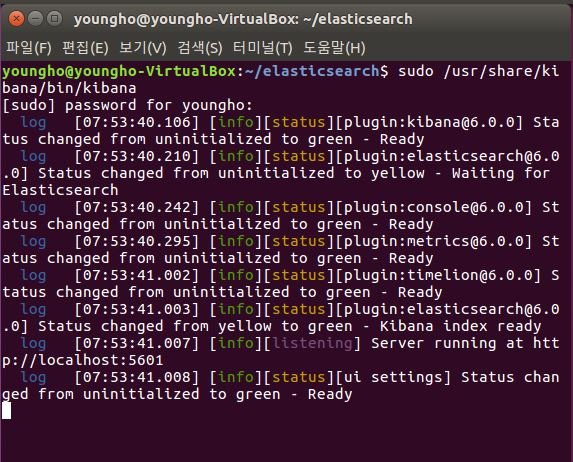
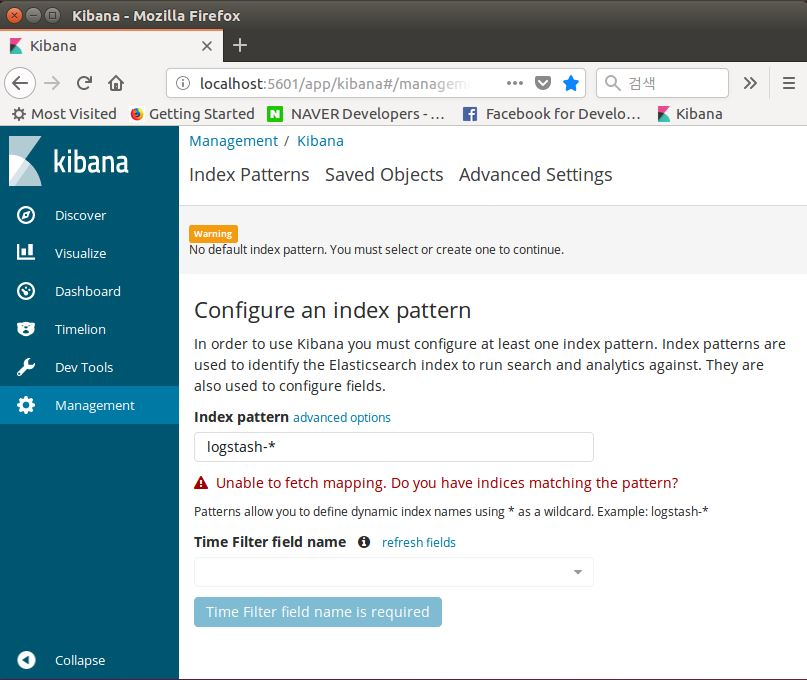

# Kibana - Install & Setup

[ELK 스택 (ElasticSearch, Logstash, Kibana) 으로 데이터 분석](https://www.inflearn.com/course/elk-%EC%8A%A4%ED%83%9D-%EB%8D%B0%EC%9D%B4%ED%84%B0-%EB%B6%84%EC%84%9D/)

# 설치 과정


## Install Elasticsearch
```
wget https://artifacts.elastic.co/downloads/kibana/kibana-6.0.0-amd64.deb
dpkg -i kibana-6.0.0-amd64.deb
```

## Config Kibana (/etc/kibana/kibana.yml)
- elasticsearch.url : YOUR_ELASTICSEARCH_URL (http://localhost:9200)
- server.host : the address to which the kibana server will bind(localhost)

```
#server.host: "localhost"
...
#elasticsearch.url: "http://localhost:9200"
...
```

## START KIBANA (/usr/share/kibana/bin/kibana)

- `sudo /usr/share/kibana/bin/kibana`
- `localhost:5601`



- 키바나 서버 접속


