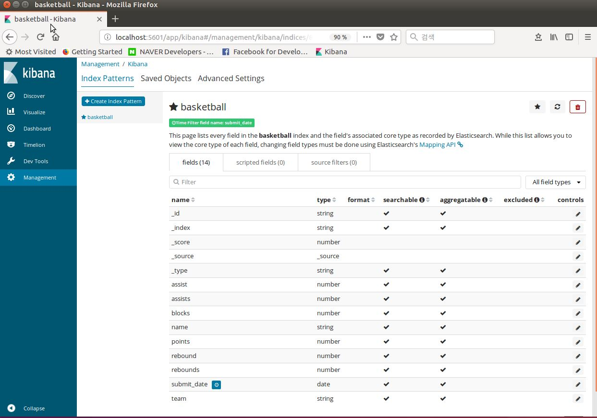

# Kibana - Management

[ELK 스택 (ElasticSearch, Logstash, Kibana) 으로 데이터 분석](https://www.inflearn.com/course/elk-%EC%8A%A4%ED%83%9D-%EB%8D%B0%EC%9D%B4%ED%84%B0-%EB%B6%84%EC%84%9D/)

## 순서
- 먼저 이전 강의에서 사용했던 Basketball 인덱스 제거
  - `curl -XDELETE 'localhost:9200/basketball?pretty'`
- 인덱스 생성
  - `curl -XPUT 'localhost:9200/basketball?pretty'`
- mapping 추가
  - `curl -H "Content-Type:Application/json" -XPUT 'localhost:9200/basketball/record/_mapping?pretty' -d @basketball_mapping.json`
- document bulk로 추가
  - `curl -H "Content-Type:Application/json" -XPOST 'localhost:9200/_bulk?pretty' --data-binary @bulk_basketball.json`

## Kibana Management

- Kibana에서 Management 클릭 -> -> Index Patterns 클릭
  - Logstash-* 있는곳 basketball입력( 우리의 Index가 basketball 이므로)
    - 자동으로 키바나가 basketball index 확인하면서 submit_date 필드를 자동으로 time_filter_field로 인식

    
